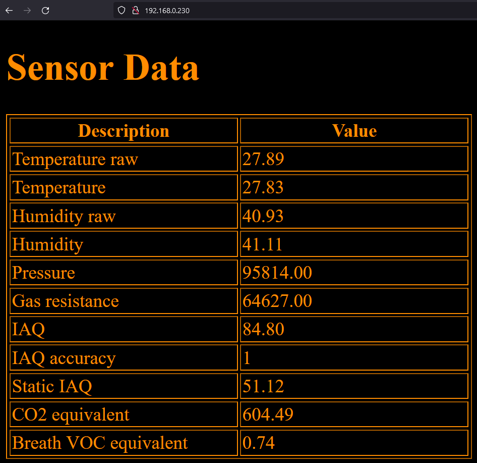
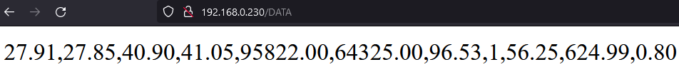

# Environment-Sensing
Greate a environment sensing dashboard using an BME 680 sensor for getting the data, an Arduino nano RP2040  connect for transmitting the data  

Table of contents
- [#Used hardware](#used-hardware)
- [#Arduino setup](#arduino-setup)
 - [#Boardmanager](#boardmanager)
 - [#Used libraries](#used-libraries)
 - [#Using the code](#using-the-code)
 - [#Getting the data](#getting-the-data)
- [#Data logger](#data-logger)

# Used hardware
- Microcontroller: [Arduino Nano RP2040 Connect](https://docs.arduino.cc/hardware/nano-rp2040-connect)
- Environmental Sensor: [Bosch BME680](https://www.bosch-sensortec.com/products/environmental-sensors/gas-sensors/bme680/)

# Arduino setup
## Boardmanager
To enable the full potential of the RP2040 the [board manager](https://github.com/earlephilhower/arduino-pico) of Earle F. Philhower wit the version 2.3.3 was used.
A guide for the installation of the board manager can be found [here](https://github.com/earlephilhower/arduino-pico), the documentation [here](https://arduino-pico.readthedocs.io/en/latest/).

## Used libraries
- [WiFiNINA_Generic](https://github.com/khoih-prog/WiFiNINA_Generic) Version 1.8.14-5 for WiFi connection
- [BSEC Software Library](https://www.bosch-sensortec.com/software-tools/software/bsec/) for getting the sensor data

Both libraries can be found in the library manager of the Arduino IDE.

## Using the code
For connecting to your network set the credentials in [secrets.h](./src/Arduino/secrets.h). In this version of the code the Arduino Nano RP2040 gets an IP assigned dynamically. If you want to set a static IP you can do that using `WiFi.config()` before connection to the network:
```
WiFi.config(ip);
WiFi.config(ip, dns);
WiFi.config(ip, dns, gateway);
WiFi.config(ip, dns, gateway, subnet)
```

If you have errors with the communication with the BME680 sensor try changing `BME680_I2C_ADDR_SECONDARY` to `BME680_I2C_ADDR_PRIMARY`.
If the communication to the sensor is still not possible try the `Basic` example in `File>Examples>Bsec software library>Basic` of `File>Examples>INCOMPATIBLE>Bsec software library>Basic` from the BSEC librabry. It has `Serial.println` statements helpfull with figguring out the error.

## Getting the data
For getting a table displaying the current sensor data open the IP address of the microcontroller in a browser


When calling ip/DATA you will get the values from the table as a simple string in the same order separated by collumns. 


# Data logger
// TODO